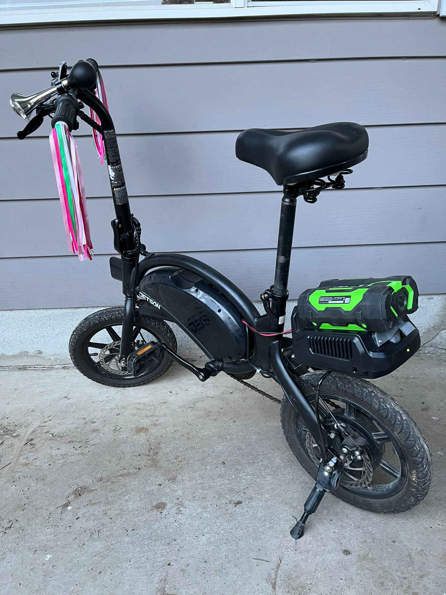

# EgoBolt
Ego Battery Adapter for Jetson Bolt Pro

## Background
I have always liked the idea of going for family bike rides. Unfortunately, my daughter (8 years old) was never very enthusiastic about the idea and was generally quite resistant whenever the suggestion came up.

I thought, maybe if I could build her an electric bike, she might be more enthusiastic. Unfortunately, there don't seem to be many kid-friendly e-bikes out there—except for one: the Jetson Bolt Pro.

I picked up a used one in good shape for about **$250 CAD**, and it worked well. But of course, the battery is nearing the end of its life, and the charge doesn’t last as long as it should. Therefore, a new battery is required.

Meanwhile, I have amassed an array of **Ego tools** over the years, each of which included its own **56V battery**. These should be a good fit for an e-bike. All that should be needed is to **drop the voltage**, **add a fuse**, and **integrate a low voltage protection circuit**.

The **Ego 4Ah** or higher should be roughly equivalent to the factory Bolt battery in terms of watt-hours.

## Bolt Pro Factory Battery Specifications
Based on research, the factory battery has the following properties:

| Property             | Value |
|----------------------|----------------|
| **Power**           | 36V / 6Ah = 214Wh |
| **Continuous Discharge** | 20A |
| **Max Charge Current** | 3A |
| **Connector Type**   | Razor Factory 4-Pin |

## Ego Battery Cell Specifications
The Ego battery consists of **18650** cells configured in **14 series**.

- **Cell Count:** 14 (in series)
- **Cell Type:** Samsung 30Q (3000mAh nominal discharge)
- **Nominal Voltage:** 3.7V
- **Max Voltage:** 4.15V
- **Max Current:** 20A (may be higher for larger batteries, but 20A to be safe)

### Ego Battery Pack Power Ratings:
| Capacity | Watt Hours |
|----------|------------|
| 2.5Ah    | 126Wh |
| 4.0Ah    | 202Wh |
| 5.0Ah    | 252Wh |
| 7.5Ah    | 378Wh |
| 12.0Ah   | TBD |

### Ego Battery Pack Voltage:
- **Nominal:** 56V (4V × 14S = 56V)
- **Max:** 58.8V (4.2V × 14S = 58.8V)

### Ego Battery Terminals:
- **+** = Positive
- **T** = Temperature
- **D** = Data
- **-** = Negative

## Battery Adapter Device Requirements
- **On/Off Switch** (to prevent parasitic battery drain)
- **Low Voltage Cutoff @ 43.5V** (must be enforced by the tool, as the battery doesn’t have this built-in)
- **Replaceable Fuse @ 20A**
- **DC-DC Converter** (drop 52V down to 36V)

## Approach
Since each tool also came with an extra charger that I don’t need, the simplest approach (at least for now) is to adapt a spare charger case to house my **DC-DC inverter**.

The device just needs to:
1. **Drop the voltage** from the Ego 52-56V down to the **36V** that the Bolt expects.
2. **Enforce a low voltage cutoff** (to protect the battery from over-discharge).
3. **Include a fuse** for added protection.
4. **Add a locking mechanism** since the EGO charger doesnt have one.

## Bill of Materials (BOM)
- **(1) DC-DC Converter**  
  [DROK CNC DC Buck Converter with Meter](https://www.amazon.ca/dp/B0CNVWC66L?ref_=pe_125682630_1045605200_t_fed_asin_title&th=1)  
  Model **FBA200707**  
  _6-70V to 0-60V, 20A, 1200W_
  
- **(1) Low Voltage Cutoff Circuit**  
  [MgcSTEM Low Voltage Disconnect and Charging Discharging Protection Board](https://www.amazon.ca/dp/B0C2VMGCZR?ref_=pe_125682630_1045605200_t_fed_asin_title)  
  Model **7f97e121-c03e-4f22-97e6-13224b8cd3e9**  
  _40A, DC 5V-60V, LCD Display_

- **(1) Fuse (20A)**
- **(1) Button** (to power on DC-DC converter)
- **(1) Switch** (Power On/Off - to stop the DC-DC converter when you get off the bike)
- **(1) Charger Case**
- **(1) Locking Mechanism** (_3D printed_)
- **(1) Electronics Mount/Tray** (_3D printed_)
- **(2) Springs for Locking Mechanism**
